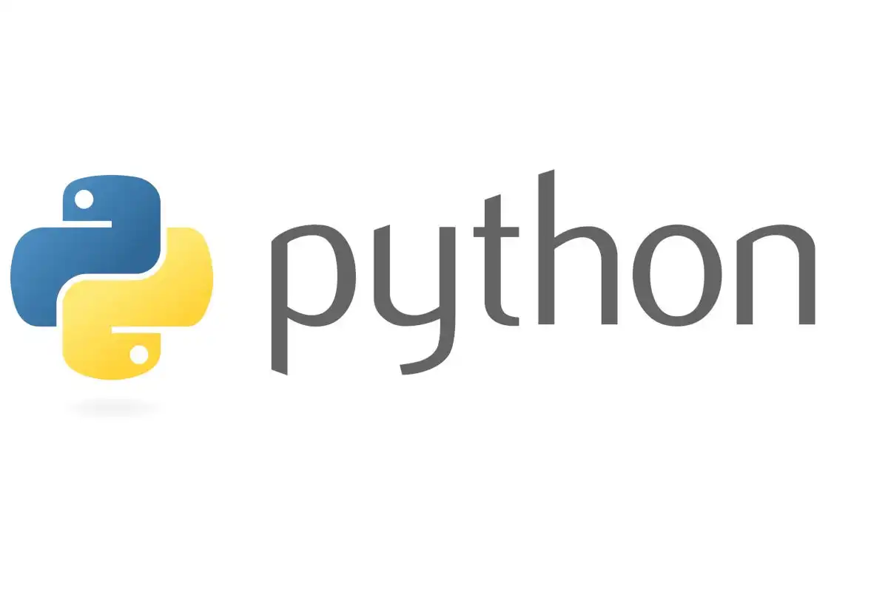
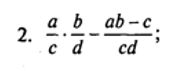
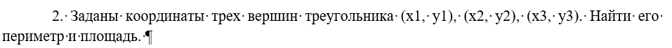
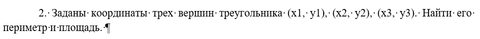
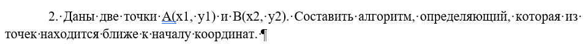
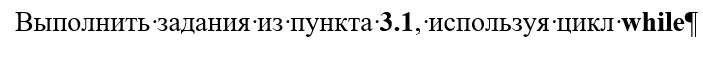

# Решение задач по основам программирования

### Задание №1.1 - Линейные алгоритмы

### Задание №1.2 - Вычисления в математических задачах

### Задание №2 - Алгоритмы с ветвлением

### Задание №3 - Цикл с параметром (for)

### Задание №4 - Цикл с параметром (while)

**Ссылки:** https://trinket.io/python3

**Авторы:** `Егорова К.П.` и `Дуплей М.И.`

**Дата:** 24.11.2024
