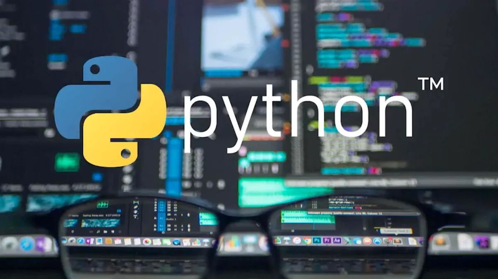

# Курс по программированию на Python

## Школа программирования Maestro7IT**

**Python** — это высокоуровневый язык программирования, который используется для общего назначения.

Он отличается простым и читаемым синтаксисом, что делает его идеальным для начинающих программистов.

Python поддерживает различные парадигмы программирования, включая объектно-ориентированное, функциональное и процедурное.

**Преподаватель:** Дуплей Максим Игоревич

**Студент:** Егорова Ксения Павловна

**Дата:** 22.09.2024